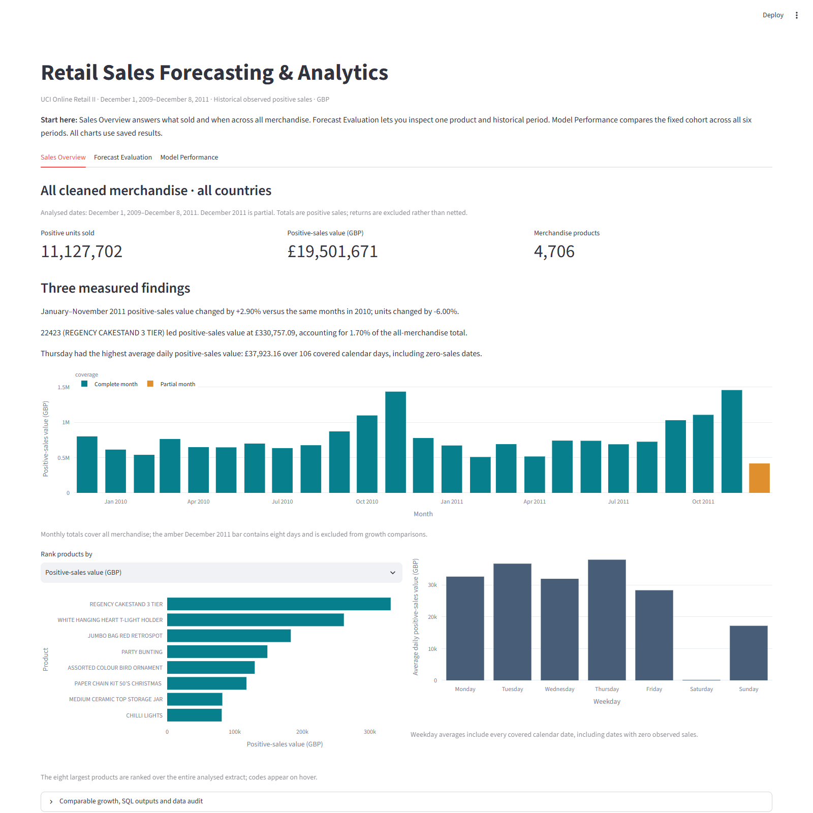

# Retail Sales Forecasting & Analytics

How do retail sales vary across products and weekdays, and how much does a more complicated forecast improve on a simple one? This project investigates those questions using real UCI Online Retail II transactions from **December 2009–December 2011**. It combines a Python data pipeline, DuckDB SQL analysis, controlled historical forecasting comparisons, and a Streamlit dashboard.

<!-- generated:headline:start -->
The **four-week weekday-average baseline** had the lowest pooled error among the tested methods: **103.56% WAPE**, versus **110.42%** for last-week repetition. This is **6.2% relative reduction in pooled absolute error** (6.86 percentage points), across **20 products and 6 retrospective 28-day periods**. The remaining error is substantial.
<!-- generated:headline:end -->



## What I built

I prepared customer-free product/date aggregates from the original workbook, wrote SQL for product rankings and comparable-period sales patterns, and built three dashboard tabs. Sales Overview explores the full cleaned merchandise data; Forecast Evaluation inspects saved forecasts; Model Performance compares methods and explains errors.

The data audit distinguishes cross-sheet replicas from repeated lines within a sheet. It retains valid positive sales with missing customer IDs and records the exclusions instead of silently dropping troublesome records. Monetary value is calculated from each transaction's quantity and price before aggregation. Calendar-day denominators include zero-sale dates.

The forecasting work compares simple weekly baselines with weekly exponential smoothing using expanding, 182-day, and 365-day histories. Training stops before every forecast begins, all methods predict the same observations, and large sales spikes remain in the scores. Saved results make the dashboard responsive: changing a product or method does not retrain a model.

## Three measured sales findings

<!-- generated:sales-findings:start -->
- January–November 2011 positive-sales value changed by +2.90% versus the same months in 2010; units changed by -6.00%.
- 22423 (REGENCY CAKESTAND 3 TIER) led positive-sales value at £330,757.09, accounting for 1.70% of the all-merchandise total.
- Thursday had the highest average daily positive-sales value: £37,923.16 over 106 covered calendar days, including zero-sales dates.

[Calculations, denominators, and SQL](docs/business-findings.md).
<!-- generated:sales-findings:end -->

These describe observed sales patterns. A change in value alongside a change in units does not establish its cause, and a leading product is not necessarily the most profitable one.

## What the forecasting comparison showed

A **baseline** is a simple forecast used as a reference. Last-week repetition copies the previous seven days; weekday averages use recent Mondays to forecast Mondays, and so on. Smoothing is the more complex statistical alternative tested here.

<!-- generated:forecast-results:start -->
| Method | Pooled WAPE (%) |
| --- | ---: |
| Four-week weekday average | 103.56 |
| 182-day smoothing | 103.98 |
| Expanding-history smoothing | 104.52 |
| Eight-week weekday average | 104.91 |
| 365-day smoothing | 107.65 |
| Last-week repetition | 110.42 |

The **four-week weekday-average baseline** had the lowest pooled error among the tested methods: **103.56% WAPE**, versus **110.42%** for last-week repetition. This is **6.2% relative reduction in pooled absolute error** (6.86 percentage points), across **20 products and 6 retrospective 28-day periods**. The remaining error is substantial.

[Detailed experiment and mixed smoothing outcomes](docs/training-window-experiment.md).
<!-- generated:forecast-results:end -->

**WAPE** measures total absolute forecast error relative to total actual units. Lower is better, but it can exceed 100%; neither WAPE nor 100 minus WAPE is accuracy. A small signed bias can also hide large overpredictions and underpredictions that cancel. The product and spike diagnostics show where pooled scores conceal important differences.

## Quick dashboard demonstration

The repository includes customer-free aggregates and saved forecasts. After installation, the dashboard runs without the raw workbook, an existing DuckDB database, or model fitting. Clone the repository, install the pinned dependencies, and launch the dashboard:

```powershell
git clone https://github.com/Anikethupadhya/retail-sales-forecasting-analytics.git
cd retail-sales-forecasting-analytics
python -m venv .venv
.\.venv\Scripts\python -m pip install -r requirements.txt
.\.venv\Scripts\python -m pip check
.\.venv\Scripts\python -m streamlit run app.py --server.headless true --browser.gatherUsageStats false
```

Use the tested Python 3.14.3 runtime and open http://localhost:8501. The three tabs answer different questions; the dashboard's Start here explanation and [walkthrough](docs/dashboard-walkthrough.md) guide you through an improvement, a deterioration, and a spike. They are illustrative examples, not representative performance evidence.

## Rebuild reports or reproduce the analysis

Report-only regeneration reads saved artifacts and preserves the maintained prose in this README:

```powershell
.\.venv\Scripts\python -m src.report
.\.venv\Scripts\python -m pytest -q
```

Full analysis audits the official workbook and reruns the existing frozen comparisons. Exact-commit verification additionally creates a new checkout and environment, then checks rebuilt results against the references. It takes considerably longer than launching the dashboard.

```powershell
.\.venv\Scripts\python -m src.pipeline
.\.venv\Scripts\python scripts/verify_reproduction.py --revision HEAD
```

See [setup and reproduction](docs/setup-and-reproduction.md) for workbook acquisition, checksums, environment requirements, and verification scope. Full execution uses a Git checkout so the committed experiment protocol and its history can be verified.

## Important limitations

All forecasts are historical backtests. The model family was selected using later-2011 validation, and some retrospective periods overlap previously inspected evaluations. Freezing a later protocol does not make these outcomes an untouched holdout. The original single-period benchmark uses a different cohort and followed a duplicate repair after its initial test was inspected; its improvement is documented separately.

The source records observed sales, not unobserved demand lost during stock-outs. Returns are excluded rather than netted, so GBP amounts are **positive-sales value**, not net revenue, profit, or savings. December 2011 is partial; growth comparisons use complete matched periods. These high-volume forecast cohorts do not represent the entire catalogue. There is no deployment, inventory simulation, significance claim, or operational savings claim.

## Data and further evidence

Source: [Chen, D. (2012), Online Retail II, UCI](https://archive.ics.uci.edu/dataset/502/online+retail+ii), [DOI:10.24432/C5CG6D](https://doi.org/10.24432/C5CG6D), **CC BY 4.0**. The retained dates are December 1, 2009–December 8, 2011. Raw transaction files stay outside Git and the review package.

- [Business findings and SQL](docs/business-findings.md)
- [Training-window experiment](docs/training-window-experiment.md) and [error analysis](docs/error-analysis.md)
- [Report ownership](docs/report-ownership.md)
- [Result sources and metric definitions](docs/result-evidence.md)
- [Verification methods and recorded runs](docs/verification.md)
