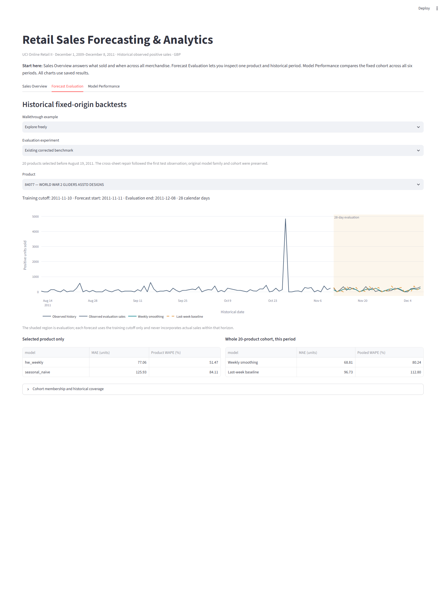
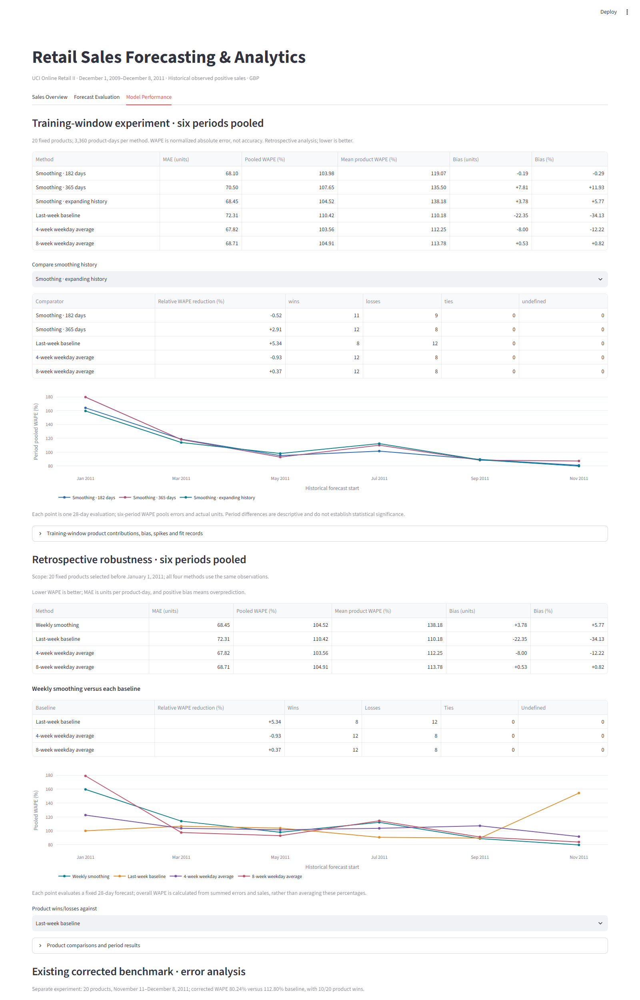

# Retail Sales Forecasting & Analytics

A reproducible portfolio project using real historical transactions, customer-free merchandise aggregates, meaningful DuckDB SQL, fixed-origin forecasting comparisons, and a three-tab Streamlit/Plotly dashboard. Forecasts describe **observed positive sales**. Actual inventory and lost demand are unavailable.

## Measured results

All-merchandise coverage: **2009-12-01 to 2011-12-08**, 1,067,371 raw rows across both workbook sheets; **1,013,327 retained merchandise lines**, **4,706 products**, **11,127,702 positive units**, and **£19,501,670.71 positive-sales value**. Value is transaction-level Quantity × Price summed before aggregation; it is not net revenue or profit. All countries are pooled.

- January–November 2011 positive-sales value changed by +2.90% versus the same months in 2010; units changed by -6.00%. ([evidence](outputs/sales/comparable_growth.csv), year=2011).
- 22423 (REGENCY CAKESTAND 3 TIER) led positive-sales value at £330,757.09, accounting for 1.70% of the all-merchandise total. ([evidence](outputs/sales/product_rankings.csv), product_id=22423).
- Thursday had the highest average daily positive-sales value: £37,923.16 over 106 covered calendar days, including zero-sales dates. ([evidence](outputs/sales/weekday_seasonality.csv), weekday=Thursday).

Retrospective robustness: **20 products**, six 28-day windows. Weekly smoothing achieved **104.52% pooled WAPE**, versus **103.56%** for the strongest pooled baseline, `weekday_mean_4w`. Relative reduction against that baseline: **-0.93%**. Smoothing beat that baseline in **3/6 windows**. The cohort shares 16 products with the existing benchmark; cohort differences prevent attributing cross-experiment differences solely to models.

| model | mae | wape | mean_product_wape | signed_bias | percentage_bias |
| --- | --- | --- | --- | --- | --- |
| hw_weekly | 68.45 | 104.52 | 138.18 | 3.78 | 5.77 |
| seasonal_naive | 72.31 | 110.42 | 110.18 | -22.35 | -34.13 |
| weekday_mean_4w | 67.82 | 103.56 | 112.25 | -8.00 | -12.22 |
| weekday_mean_8w | 68.71 | 104.91 | 113.78 | 0.53 | 0.82 |

| baseline | relative_wape_reduction_pct | wins | losses | ties | undefined | win_pct |
| --- | --- | --- | --- | --- | --- | --- |
| seasonal_naive | 5.34 | 8 | 12 | 0 | 0 | 40.00 |
| weekday_mean_4w | -0.93 | 12 | 8 | 0 | 0 | 60.00 |
| weekday_mean_8w | 0.37 | 12 | 8 | 0 | 0 | 60.00 |

The **existing corrected benchmark** is separately preserved: 20 products, 28 days, **112.80% baseline WAPE**, **80.24% smoothing WAPE**, **28.86% relative reduction**, and 10/20 product wins. The first pre-correction execution reported **80.43%** and **28.70%** respectively. The correction removed 22,523 cross-sheet replicas after the first test was observed, without changing the selected family or cohort. This repaired rerun is not a newly untouched holdout. Historical artifacts and titles are immutable and exempt from the current project renaming.

## Setup and full reproduction

Tested Python 3.14.3; installed versions, raw-file and protocol checksums are recorded in `outputs/run_manifest.json`. All Python requirements are pinned.

```powershell
python -m venv .venv
.\.venv\Scripts\python -m pip install -r requirements.txt
.\.venv\Scripts\python -m src.pipeline
.\.venv\Scripts\python -m pytest -q --junitxml=outputs/verification/tests.xml
.\.venv\Scripts\python -m streamlit run app.py --server.headless true --browser.gatherUsageStats false
```

**Full analysis command: `python -m src.pipeline`** using the installed environment. It audits the workbook, builds sales SQL outputs, reconciles and explains saved benchmark predictions, evaluates the frozen robustness protocol, and regenerates documentation from measured outputs. The historical benchmark is loaded and reconciled, not retrained. The dashboard loads saved aggregates and predictions and does not fit models. Open http://localhost:8501. Rebuild the ignored DuckDB binary by running the pipeline.

Original data: [Chen, D. (2012), Online Retail II, UCI](https://archive.ics.uci.edu/dataset/502/online+retail+ii), [DOI:10.24432/C5CG6D](https://doi.org/10.24432/C5CG6D), CC BY 4.0. Raw workbook: `data/raw/online_retail_II.xlsx`; SHA-256 `bcbe73b35f5b7babf197fb0cb983a11f5d9ff929078d4aa53d171b1f2df2e980`. [Manual download instructions](docs/data-download.md) are available if official acquisition fails. Raw data, local workbook caches and database binaries stay outside Git and the review ZIP.

## Data rules and scope

Preserve the existing cleaning rules: exclude invalid dates, missing invoice/product IDs, exact cross-sheet replicas, cancellations, nonpositive/invalid quantities, non-merchandise codes, nonpositive prices and the potentially truncated final trading day. Both sheet schemas are inspected explicitly. Source sheet overlap is matched on full original fields and within-sheet occurrence number, preserving repeated lines inside each sheet. Missing customer IDs alone do not exclude valid sales. Audit counts reconcile in `outputs/sales/data_audit.json`; the retained count agrees with the corrected historical audit. Returns are not netted against positive units or value. No outliers are trimmed.

December 2011 is partial, with only December 1–8 retained. SQL computes monthly growth only for adjacent complete calendar months; annual comparison uses January–November 2010 versus the same months in 2011. Complete coverage means within extract bounds, not proof the merchant had no missing transactions. Weekday averages use covered calendar-day denominators and include zero-sale days. Product rankings cover **all cleaned merchandise**; forecast results cover their named **fixed cohort**; individual product metrics are displayed separately.

## Fixed robustness protocol

`protocols/robustness_v1.json` and its SHA-256 were saved before computing new forecasts. Starts are January 1, March 1, May 1, July 1, September 1 and November 1, 2011. Training ends the previous day; horizon day 1 equals forecast_start. Training windows expand from December 1, 2009.

| forecast_start | train_end | forecast_end | training_days |
| --- | --- | --- | --- |
| 2011-01-01 | 2010-12-31 | 2011-01-28 | 396 |
| 2011-03-01 | 2011-02-28 | 2011-03-28 | 455 |
| 2011-05-01 | 2011-04-30 | 2011-05-28 | 516 |
| 2011-07-01 | 2011-06-30 | 2011-07-28 | 577 |
| 2011-09-01 | 2011-08-31 | 2011-09-28 | 639 |
| 2011-11-01 | 2011-10-31 | 2011-11-28 | 700 |

Eligibility uses only dates before January 1, 2011: at least 365 initial calendar days, first sale within 90 days of grid start, active on at least 25% of initial days and 30% of the last 90 days. Rank descending initial positive units with ascending product-ID ties; select up to 20 without relaxing thresholds. Initial metadata descriptions also use that period. Save all eligibility decisions, IDs, and differences from the existing August-selected cohort.

Methods: last-week seasonal naive; averages of matching weekdays from the preceding 28 or 56 calendar days, fixed and repeated throughout the horizon; and the existing additive weekly Holt-Winters specification without trend. Refit the same specification at each origin with estimated initialization, optimized coefficients and `use_brute=False`. No later fitted parameters or within-horizon observations are reused. Negative predictions are clipped at zero. Model exceptions, nonfinite predictions and optimizer failures use a recorded last-week fallback. This run recorded 0 fallback fits and 572 clipped horizon predictions. Full warnings and failures are in `outputs/robustness/model_events.json`.

**Retrospective limitation:** the model family was chosen on later-2011 validation before this experiment. Earlier windows stress-test that specification and are not a strategy chosen prospectively in January. September and November overlap existing evaluation dates. These comparisons are not independent confirmation or a fresh untouched holdout.

## Metrics and error analysis

MAE is mean absolute error in units per product-day. Pooled WAPE is `100 × sum(abs(prediction − actual)) / sum(actual)`; overall robustness uses all six windows together, not a mean of window percentages. Mean product WAPE averages defined per-product WAPEs. Signed bias is `mean(prediction − actual)`, positive for overprediction; percentage bias is `100 × sum(prediction − actual) / sum(actual)`. Zero actual denominators produce null percentage metrics; zero baseline WAPE produces null relative reduction. WAPE can exceed 100%; **WAPE and 100 − WAPE are not accuracy**.

Product comparisons report wins, losses, ties within 1e-9 absolute-error units and undefined cases against **each baseline**. Positive-sales denominators must be defined for percentage-based comparisons. Relative reduction preserves negative outcomes. Summed product errors and contributions reconcile to pooled results. [Error-analysis report and interactive charts](docs/error-analysis.md) show five largest improvements/deteriorations, direction of error, and training-defined spikes without dropping observations or asserting unverified causes.

## Dashboard and SQL

Exactly three tabs: **Sales Overview**, **Forecast Evaluation**, **Model Performance**. Overview shows all-merchandise units/value, trends, rankings, weekday averages and three measured findings. Evaluation selects experiment, historical period and product, displaying actual versus baseline/model forecasts, origin dates, and product/cohort metrics. Performance shows original validation evidence, robustness methods and periods, pairwise wins/losses, error contributions and spike examples. Technical audit details are in expanders. Historical archives preserve the prior implementation; the active project contains no supplier or inventory scenarios.





Standalone SQL: `product_rankings.sql`, `monthly_trends.sql`, `weekday_seasonality.sql`, `comparable_growth.sql`. Tables: `sales` (customer-free product-date aggregates), `product_metadata`, `calendar`, `daily_totals`. Queries demonstrate aggregation, joins, rankings and lag windows. Outputs are saved in `outputs/sales/`.

## Verification and deliverables

Tests cover chronology, future-information perturbations, weekday-baseline arithmetic, cohort independence, metrics and zero denominators, pairwise comparisons, SQL growth/weekday arithmetic, transaction-value aggregation, archive integrity and output reconciliation. Streamlit tests and rendered browser inspection exercise tabs, experiment/product/period controls, scope labels and charts. Evidence is in `outputs/verification/`, including test reports, browser screenshots and clean-environment reproduction status. A fresh environment with empty workbook caches must reproduce measured outputs to absolute tolerance 1e-8 and relative tolerance 1e-10 for forecasts/metrics (GBP sales aggregates: absolute 1e-6, relative 1e-10).

Folders: `src/` analysis modules; `sql/` standalone queries; `protocols/` frozen experiment; `archives/` immutable historical evidence; `outputs/sales/`, `outputs/robustness/`, `outputs/benchmark_analysis/` separate results; `docs/` explanations, evidence and screenshots. `scripts/package_review.py` creates an allowlisted review ZIP and manifest, excluding raw/customer-level extracts, environments, caches and database binaries. [Version control and portfolio evidence](docs/version-control.md) explains the private repository, backup scope, and workflow for recording future improvements.

## Limitations and one next experiment

Sales proxy demand; actual inventory, lost sales and promotions are unavailable. Calendar zeros cannot distinguish closures, absent records or stock-outs. Merchandise-code and price rules can exclude unconventional valid records. Bulk-order spikes remain. Six non-overlapping robustness windows in one year do not demonstrate universal or future performance. No prediction intervals are supplied. Cohorts are high-volume subsets, not the full catalogue.

A useful next experiment is a prespecified training-window comparison (expanding history versus recent 180/365 days) for the same weekly smoothing specification and baselines, keeping this experiment archived and using separately declared historical windows. The current comparison alone does not authorize changing the frozen model or reporting a fresh holdout.

## Proposed resume entry

- Benchmarked four 28-day sales forecasting methods across six retrospective periods and 20 products using Python, pandas and statsmodels; reported 104.5% smoothing-model WAPE versus 103.6% for the strongest baseline.
- Audited 1,067,371 UCI transaction rows and built DuckDB SQL sales rankings, comparable-period growth and weekday analysis with a three-tab Streamlit/Plotly dashboard and evidence-backed error analysis.

[Numerical claim evidence](docs/resume-evidence.md) separates existing corrected benchmark claims from retrospective robustness outcomes. [Interview guide](docs/interview-guide.md) explains the methods and limitations.
